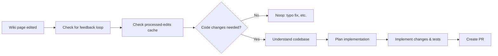

# 🔧 Agentic Wiki Coder

> For an overview of all available workflows, see the [main README](../README.md).

**Turns wiki edits into code — automatically implements changes described in your GitHub wiki**

The [Agentic Wiki Coder workflow](../workflows/agentic-wiki-coder.md?plain=1) is the reverse of the [Agentic Wiki Writer](agentic-wiki-writer.md): instead of writing wiki pages from code, it reads wiki edits and implements the described changes in the codebase. When a collaborator edits a wiki page to describe new behavior or updated functionality, this workflow detects the change and opens a pull request with the corresponding code implementation.

## Installation

```bash
# Install the 'gh aw' extension
gh extension install github/gh-aw

# Add the workflow to your repository
gh aw add-wizard githubnext/agentics/agentic-wiki-coder
```

This walks you through adding the workflow to your repository.

## How It Works



The workflow triggers on GitHub's `gollum` event (wiki edits). It reads the changed wiki pages, decides whether code changes are needed (skipping pure documentation fixes like typos), then implements the changes following the project's existing conventions.

### Key Features

- **Feedback-loop safe**: Skips edits made by `github-actions[bot]` to prevent infinite loops with Agentic Wiki Writer
- **Idempotent**: Tracks processed edit SHAs in repo memory to avoid duplicate work
- **Convention-aware**: Reads existing source files before implementing to match naming, structure, and testing patterns
- **Triage built-in**: Only opens a PR when the wiki edit genuinely requires new or changed code

### What triggers a PR

The workflow opens a PR when wiki edits describe:
- New features or capabilities
- Changed behavior for existing functionality
- New configuration options, API endpoints, or CLI commands
- New test scenarios that reveal missing coverage

It does **not** open a PR for typo fixes, formatting changes, or clarifications of already-correct behavior.

## Usage

### Setup

This workflow requires your repository to have a wiki enabled. It pairs naturally with [Agentic Wiki Writer](agentic-wiki-writer.md) to create a full bidirectional documentation loop.

After editing the workflow file, run `gh aw compile` to update the compiled workflow and commit all changes to the default branch.

## Learn More

- [Agentic Wiki Coder source workflow](https://github.com/githubnext/agentics/blob/main/workflows/agentic-wiki-coder.md)
- [Agentic Wiki Writer](agentic-wiki-writer.md) — the paired reverse workflow
- [GitHub Wikis documentation](https://docs.github.com/en/communities/documenting-your-project-with-wikis)
