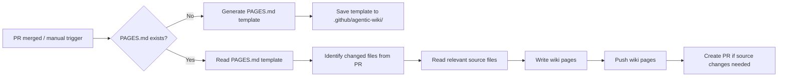

# 📖 Agentic Wiki Writer

> For an overview of all available workflows, see the [main README](../README.md).

**Automatically generates and maintains GitHub wiki pages from your source code**

The [Agentic Wiki Writer workflow](../workflows/agentic-wiki-writer.md?plain=1) keeps your project's GitHub wiki synchronized with the codebase. After each merged pull request (or on demand), it reads a `PAGES.md` template to understand what to document, then writes wiki pages directly from the source code.

## Installation

```bash
# Install the 'gh aw' extension
gh extension install github/gh-aw

# Add the workflow to your repository
gh aw add-wizard githubnext/agentics/agentic-wiki-writer
```

This walks you through adding the workflow to your repository.

## How It Works



On the first run (or when `regenerate-template` is enabled), the workflow generates a `PAGES.md` template describing the wiki structure it will maintain. On subsequent runs it follows the template — reading only the source files relevant to the merged PR, then writing updated wiki content.

### Key Features

- **Incremental updates**: Uses repo memory to track content hashes and skip unchanged pages
- **Template-driven**: A `PAGES.md` file in `.github/agentic-wiki/` controls what gets documented
- **Paired with Agentic Wiki Coder**: Together they form a bidirectional sync between wiki and source code

## Usage

### First Run

Trigger the workflow manually with `regenerate-template: true` to create the initial `PAGES.md` template. Review and customize the template to match your documentation goals.

### Configuration

The workflow triggers automatically on every merged PR to the default branch. You can also trigger it manually from the Actions tab:

- **`regenerate-template`** (`boolean`, default `false`) — Set to `true` to rebuild the `PAGES.md` template from scratch.

After editing the workflow file, run `gh aw compile` to update the compiled workflow and commit all changes to the default branch.

## Learn More

- [Agentic Wiki Writer source workflow](https://github.com/githubnext/agentics/blob/main/workflows/agentic-wiki-writer.md)
- [Agentic Wiki Coder](agentic-wiki-coder.md) — the paired reverse workflow
- [GitHub Wikis documentation](https://docs.github.com/en/communities/documenting-your-project-with-wikis)
