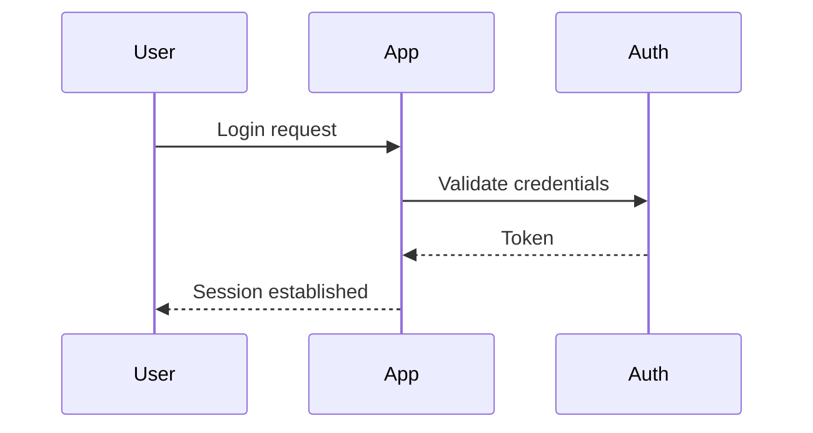

# 📊 Archie - Mermaid Diagram Generator

> For an overview of all available workflows, see the [main README](../README.md).

**On-demand Mermaid diagram generation for issues and pull requests**

The [Archie workflow](../workflows/archie.md?plain=1) analyzes issue or pull request content and generates clear Mermaid diagrams that visualize the key concepts, relationships, and flows described within. Invoke it with `/archie` to instantly get a visual representation of any complex issue or PR.

## Installation

```bash
# Install the 'gh aw' extension
gh extension install github/gh-aw

# Add the workflow to your repository
gh aw add-wizard githubnext/agentics/archie
```

This walks you through adding the workflow to your repository.

## How It Works

```mermaid
graph LR
    A[/archie command] --> B[Fetch issue or PR details]
    B --> C[Extract relationships and concepts]
    C --> D[Select diagram types]
    D --> E[Generate 1-3 Mermaid diagrams]
    E --> F[Validate syntax]
    F --> G[Post comment with diagrams]
```

Archie fetches the full content of the triggering issue or PR, identifies key entities and relationships, picks the most appropriate Mermaid diagram type (flowchart, sequence, class diagram, gantt, etc.), and posts a well-formatted comment with between 1 and 3 diagrams.

## Usage

Comment on any issue or pull request:

```
/archie
```

Archie will analyze the content and reply with diagrams. You can also trigger it again after updating the issue to regenerate diagrams reflecting the new state.

### Configuration

The workflow runs with sensible defaults:
- **Max diagrams**: 3 per invocation
- **Timeout**: 10 minutes
- **Trigger**: `/archie` command in issues, issue comments, PRs, or PR comments

After editing, run `gh aw compile` to update the workflow and commit all changes to the default branch.

### Human in the Loop

- Archie generates diagrams but never modifies your issue or PR content
- Regenerate diagrams at any time by commenting `/archie` again as the issue evolves
- The diagrams are advisory — they summarize and visualize, not prescribe

## What It Visualizes

Archie selects the best diagram type based on the content:

| Content Type | Diagram Type |
|---|---|
| Process flows, dependencies, steps | `graph` / `flowchart` |
| Interactions between components or users | `sequenceDiagram` |
| Data structures, relationships | `classDiagram` |
| Branch strategies, merges | `gitGraph` |
| Timelines, milestones | `gantt` |
| Proportional data | `pie` |

## Example Output

For a feature issue describing an authentication flow, Archie might generate:



## Notes

- Diagrams are kept simple and use only GitHub-compatible Mermaid syntax (no custom styling or themes)
- On very simple issues with no identifiable structure, Archie generates a single summary diagram
- The `/archie` command is role-gated: only users with write access or above can trigger it
