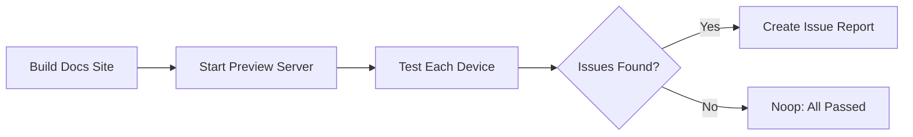

# 📱 Multi-Device Docs Tester

> For an overview of all available workflows, see the [main README](../README.md).

**Build and test your documentation site across mobile, tablet, and desktop devices to catch responsive design issues before they reach users**

The [Multi-Device Docs Tester workflow](../workflows/daily-multi-device-docs-tester.md?plain=1) builds your documentation site locally, serves it, and runs Playwright-powered tests across a range of device viewports. It checks for layout problems, inaccessible navigation, overflowing content, and broken interactive elements — then creates a GitHub issue with a detailed report when problems are found.

## Installation

```bash
# Install the 'gh aw' extension
gh extension install github/gh-aw

# Add the workflow to your repository
gh aw add-wizard githubnext/agentics/daily-multi-device-docs-tester
```

This walks you through adding the workflow to your repository.

## How It Works



The workflow builds your docs site using npm, starts a local preview server, and runs Playwright browser automation across mobile (390–393 px), tablet (768–834 px), and desktop (1366–1920 px) viewports. For each device it checks page load, navigation usability, content readability, image sizing, interactive element reachability, and basic accessibility.

## Requirements

Your repository must have a documentation site that:

- Lives in a subdirectory (default: `docs/`)
- Has a `package.json` with a `build` script and a `preview` (or equivalent serve) script
- Serves on a local port when running the preview command

Common frameworks that work out of the box include [Astro Starlight](https://starlight.astro.build/), [Docusaurus](https://docusaurus.io/), [VitePress](https://vitepress.dev/), and similar npm-based documentation tools.

## Usage

### Configuration

The workflow can be customised via `workflow_dispatch` inputs:

| Input | Default | Description |
|-------|---------|-------------|
| `devices` | `mobile,tablet,desktop` | Comma-separated list of device types to test |
| `docs_dir` | `docs` | Directory containing the documentation site |
| `build_command` | `npm run build` | Command to build the site |
| `serve_command` | `npm run preview` | Command to serve the built site |
| `server_port` | `4321` | Port the local server listens on |

After editing run `gh aw compile` to update the workflow and commit all changes to the default branch.

### Commands

You can start a run of this workflow immediately by running:

```bash
gh aw run daily-multi-device-docs-tester
```

Or trigger it from the GitHub Actions tab using workflow dispatch to customise which devices to test.

### When Issues Are Found

The workflow creates a GitHub issue titled **📱 Multi-Device Docs Testing Report** containing:

- A summary table (passed / warnings / critical per device)
- A visible list of critical issues that block functionality
- Collapsible sections with per-device details and warning listings
- Accessibility findings
- Actionable recommendations

Issues expire after 2 days so the tracker stays clean as problems are fixed.
