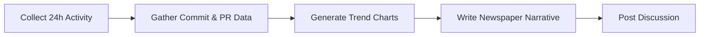

# 📰 Daily Repository Chronicle

> For an overview of all available workflows, see the [main README](../README.md).

**Transform daily repository activity into an engaging newspaper-style narrative**

The [Daily Repository Chronicle workflow](../workflows/daily-repo-chronicle.md?plain=1) collects recent repository activity — commits, pull requests, issues, and discussions — and narrates it like a newspaper editor, producing a vivid, human-centered account of the day's development story. Two trend charts visualize the last 30 days of activity.

## Installation

```bash
# Install the 'gh aw' extension
gh extension install github/gh-aw

# Add the workflow to your repository
gh aw add-wizard githubnext/agentics/daily-repo-chronicle
```

This walks you through adding the workflow to your repository.

## How It Works



A new discussion is posted each weekday with the `📰` prefix. Older chronicles are automatically closed when a new one is created.

## Usage

### Configuration

This workflow requires no configuration and works out of the box for any repository with issues, pull requests, and commit activity. You can customize the cron schedule, narrative tone, discussion category, and the sections covered.

After editing run `gh aw compile` to update the workflow and commit all changes to the default branch.

**Note**: The workflow posts discussions in the `announcements` category. Make sure this category exists in your repository's Discussions settings, or update `category:` in the workflow to match an existing category.

### Commands

You can start a run of this workflow immediately by running:

```bash
gh aw run daily-repo-chronicle
```

## Output

Each run produces a GitHub Discussion in the `announcements` category with:

- **📰 Headline News** — The most significant event of the past 24 hours
- **📊 Development Desk** — A narrative account of pull request activity
- **🔥 Issue Tracker Beat** — New issues, closed victories, and ongoing investigations
- **💻 Commit Chronicles** — The story told through commits, with developer attribution
- **📈 The Numbers** — A statistical snapshot with embedded trend charts

Charts show 30-day trends for issues, PRs, commits, and contributor activity.

## Tone & Attribution

The chronicle treats developers as protagonists and automation as their tools. Bot activity (from Copilot, GitHub Actions, etc.) is attributed to the humans who triggered, reviewed, or merged it — never framed as autonomous. The result is a narrative that celebrates the humans behind the code.

On quiet days with minimal activity, a "Quiet Day" edition is produced instead.
