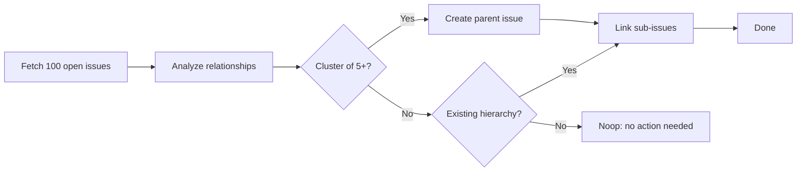

# 🌳 Issue Arborist

> For an overview of all available workflows, see the [main README](../README.md).

**Daily automated workflow that organizes your issue tracker by linking related issues as parent-child relationships**

The [Issue Arborist workflow](../workflows/issue-arborist.md?plain=1) keeps your issue tracker tidy and navigable. Every day it analyzes your open issues, detects natural parent-child relationships (epics with tasks, bugs with root causes, related feature clusters), and links them as GitHub sub-issues. When it finds five or more related issues with no common parent, it creates one.

## Installation

```bash
# Install the 'gh aw' extension
gh extension install github/gh-aw

# Add the workflow to your repository
gh aw add-wizard githubnext/agentics/issue-arborist
```

This walks you through adding the workflow to your repository.

## How It Works



The workflow downloads the 100 most recent open issues (excluding those already linked as sub-issues), then applies semantic analysis to detect clusters and hierarchies. It only acts when it's confident — it's designed to be conservative and precise, creating links only when the relationship is clear.

### What it links

| Pattern | Example |
|---------|---------|
| **Feature with tasks** | "Add OAuth support" → "Implement OAuth login", "Add OAuth callback handler" |
| **Epic with work items** | "[Epic] Refactor auth module" → related refactoring issues |
| **Bug with root cause** | "Login fails on mobile" links to "Session cookie not set for mobile agents" |
| **Orphan clusters** | 5+ issues all about "documentation" → new "[Parent] Documentation Improvements" |

### What it won't do

- Link issues when the relationship is ambiguous or weak
- Create parent issues for fewer than 5 related orphan issues
- Re-process issues that already have a parent

## Examples

From Peli's Agent Factory:

> "The Issue Arborist has created **77 discussion reports** and **18 parent issues** to group related sub-issues. It keeps the issue tracker organized by automatically linking related issues, building a dependency tree we'd never maintain manually."

Example: grouping engine documentation updates into a single trackable parent ([#12037](https://github.com/github/gh-aw/issues/12037)).

## Usage

### Configuration

The workflow runs daily and can also be triggered manually from the Actions tab. It works out of the box with no configuration needed.

**Limits per run:**
- Maximum 5 new parent issues created
- Maximum 50 sub-issue links created

After editing the workflow file, run `gh aw compile` to update the compiled workflow and commit all changes to the default branch.

### When to use it

Issue Arborist is most effective when:
- Your repository has 20+ open issues
- Issues are created organically (without always setting explicit parent-child relationships)
- You want to surface hidden structure in your backlog

It complements [Issue Triage](issue-triage.md) (which labels and prioritizes issues) and [Sub-Issue Closer](sub-issue-closer.md) (which closes parents when all sub-issues are done).

## Learn More

- [Issue Arborist source workflow](https://github.com/github/gh-aw/blob/main/.github/workflows/issue-arborist.md)
- [Sub-Issue Closer](sub-issue-closer.md) — automatically closes parent issues when all sub-issues are complete
- [Issue Triage](issue-triage.md) — label and prioritize new issues
- [GitHub sub-issues documentation](https://docs.github.com/en/issues/tracking-your-work-with-issues/using-issues/adding-sub-issues)
