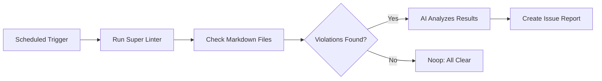

# 📝 Markdown Linter

> For an overview of all available workflows, see the [main README](../README.md).

**Run Markdown quality checks across all documentation files and get a prioritized issue report of violations**

The [Markdown Linter workflow](../workflows/markdown-linter.md?plain=1) runs the [Super Linter](https://github.com/super-linter/super-linter) tool on every Markdown file in your repository, then uses an AI agent to analyze the results and create a detailed GitHub issue listing each violation with suggested fixes. Only Markdown files are checked — other file types are unaffected.

## Installation

```bash
# Install the 'gh aw' extension
gh extension install github/gh-aw

# Add the workflow to your repository
gh aw add-wizard githubnext/agentics/markdown-linter
```

This walks you through adding the workflow to your repository.

## How It Works



The workflow runs in two jobs. The first job runs Super Linter to lint all Markdown files and uploads the log as an artifact. The second job (the AI agent) downloads that log, categorizes violations by severity, and creates a prioritized GitHub issue with recommended fixes. Previous issues expire after 2 days to avoid accumulation.

## Usage

The workflow runs on weekdays at 2 PM UTC and can also be triggered manually via `workflow_dispatch`.

### Configuration

After editing run `gh aw compile` to update the workflow and commit all changes to the default branch.

### Customizing What Gets Linted

By default only Markdown files are validated (`VALIDATE_MARKDOWN: "true"`, `VALIDATE_ALL_CODEBASE: "false"`). To extend validation to other file types, add the appropriate `VALIDATE_*` environment variables to the Super Linter step. See the [Super Linter documentation](https://github.com/super-linter/super-linter#environment-variables) for a full list.
